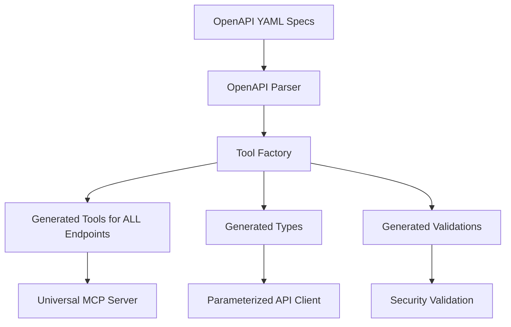

# YAML-First Development Philosophy & Agent Development Guide

## 🎯 CORE PHILOSOPHY: YAML as Single Source of Truth

This project follows a **YAML-FIRST** development philosophy where the OpenAPI specification serves as the **single source of truth** for all API interactions, types, validations, and tool generation.

### Why YAML-First is Essential

**The fundamental principle**: If it's not in the OpenAPI YAML, it shouldn't exist in the code.

## 🚫 Anti-Patterns to Avoid

### ❌ Manual Type Definitions
```typescript
// DON'T DO THIS - Manual types will become outdated
interface Account {
  type: 'account';
  id: string;
  attributes: {
    referenceId: string;
    // ... manual properties that may drift from API
  };
}
```

### ❌ Manual Zod Schemas
```typescript
// DON'T DO THIS - Manual validation that duplicates YAML
const createAccountSchema = z.object({
  referenceId: z.string(),
  accountTypeId: z.string().optional(),
  // ... validation logic already defined in OpenAPI
});
```

### ❌ Redundant API Methods
```typescript
// DON'T DO THIS - Separate methods for each resource
async createAccount(request: CreateAccountRequest) { ... }
async createCase(request: CreateCaseRequest) { ... }
async createVerification(request: CreateVerificationRequest) { ... }
// This pattern leads to maintenance nightmare
```

### ❌ Hardcoded Endpoints
```typescript
// DON'T DO THIS - Hardcoded URLs that can't adapt to API changes
return this.post('/accounts', data);
return this.post('/cases', data);
```

## ✅ YAML-First Patterns

### ✅ YAML-Derived Tools
```typescript
// DO THIS - Generate ALL tools from OpenAPI spec
const tools = toolFactory.generateToolsForTag('Accounts', {
  includeOptionalParams: true,
  validateResponses: true,
  cacheResponses: true,
});
```

### ✅ Parameterized API Client
```typescript
// DO THIS - Universal methods that work with ANY YAML endpoint
async post<T>(url: string, data: any, params?: QueryParams): Promise<T> {
  // Works with all YAML-defined endpoints
}
```

### ✅ Auto-Generated Types
```typescript
// DO THIS - Types derived directly from YAML schemas
const types = await openAPIParser.getAllSchemas();
// Perfect sync with API specification
```

## 🏗️ Architecture Overview

This is an MCP server that **dynamically generates ALL tools** from the Persona API OpenAPI specification. Tools are **not statically defined** in the codebase but are generated at runtime from the YAML spec.

### Dynamic Tool Generation Flow



## 🔍 Finding Tool Definitions (YAML-First Way)

### Step 1: Check the OpenAPI Specification FIRST
```bash
# The YAML spec is the ONLY source of truth
ls -la openapi/
# Points to: ../persona-web/openapi/external/openapi.yaml
```

### Step 2: Understand Universal Tool Generation
**Important**: Tools are generated for **ALL ENDPOINTS** in the YAML, not just inquiries:

- `accounts` endpoints → Account tools (create, list, retrieve, update)
- `cases` endpoints → Case tools
- `verifications` endpoints → Verification tools
- `reports` endpoints → Report tools
- `transactions` endpoints → Transaction tools
- `devices` endpoints → Device tools
- And **ALL other endpoints** defined in the YAML

### Step 3: Tool Generation Logic
```typescript
// Universal tool generation for ALL tags/endpoints
src/tools/generated/all-tools.ts:initializeAllTools()

// Tool factory generates from YAML
src/tools/generators/tool-factory.ts:generateToolsForTag()

// OpenAPI parsing for ALL endpoints
src/tools/generators/openapi-parser.ts
```

## 📁 YAML-First Project Structure

```
src/
├── tools/
│   ├── generated/           # ALL YAML-generated tools
│   │   └── all-tools.ts     # Universal tool generator for ALL endpoints
│   └── generators/          # YAML parsing and tool generation
│       ├── openapi-parser.ts
│       └── tool-factory.ts
├── api/
│   ├── client.ts           # Parameterized client (works with ANY endpoint)
│   └── types.ts            # YAML-derived type exports ONLY
└── openapi/                # OpenAPI specifications (YAML files)
    └── *.yaml              # Single source of truth
```

## 🔧 Development Workflow (YAML-First)

### Adding New Functionality
1. **Check YAML First**: Verify endpoint exists in OpenAPI spec
2. **Update YAML if Needed**: Add/modify endpoints in the specification
3. **Regenerate Everything**: Run tool generator to pick up changes automatically
4. **Zero Manual Code**: No manual types, schemas, or validations needed

### Debugging (YAML-First)
1. **Validate Against YAML**: Ensure API behavior matches OpenAPI spec
2. **Check Tool Generation**: Verify tools generate correctly from YAML
3. **Update YAML if Mismatched**: Fix the spec, not the code

## 🛡️ YAML-First Security

All validation comes from the YAML specification:
- **Input validation**: Generated from OpenAPI parameter schemas
- **Response validation**: Generated from OpenAPI response schemas
- **Type safety**: Generated from OpenAPI type definitions
- **Rate limiting**: Can be derived from OpenAPI extensions

## 📋 Code Review Checklist (YAML-First)

- [ ] **No manual type definitions** (check for `interface`, `type`, manual Zod schemas)
- [ ] **No hardcoded endpoints** (should be YAML-derived)
- [ ] **No manual validation logic** (should be YAML-derived)
- [ ] **All functionality uses tool factory pattern**
- [ ] **OpenAPI specification is up to date**
- [ ] **Changes update YAML first, then regenerate code**

## 🎯 Benefits of YAML-First Architecture

1. **🔄 Always in Sync**: API changes automatically propagate everywhere
2. **📚 Complete Coverage**: Every YAML endpoint gets tools automatically
3. **🛡️ Type Safety**: Full TypeScript support without maintenance
4. **⚡ Fast Development**: New endpoints require zero manual work
5. **🧪 Better Testing**: Generated tools include YAML example data
6. **📖 Self-Documenting**: Descriptions come from YAML documentation
7. **🔧 Zero Maintenance**: Types, validations, tools stay current automatically

## 🚨 Common Mistakes to Avoid

### ❌ Searching for Tool Names in Code
```bash
# DON'T do this (won't find anything)
grep -r "account_create" src/
grep -r "case_list" src/
```

### ❌ Creating Manual Implementations
```typescript
// DON'T do this - manual tools that bypass YAML
export async function createAccount(input: CreateAccountInput) {
  // Manual implementation that will become outdated
}
```

### ✅ Correct Approach
```bash
# DO this instead - look at generation logic
grep -r "generateToolsForTag" src/
grep -r "getAllToolDefinitions" src/
```

## 🔍 Finding Tool Logic (YAML-First Way)

```bash
# ✅ Look at YAML-first generation
grep -r "initializeAllTools" src/
grep -r "getAllToolDefinitions" src/
grep -r "toolFactory.generateToolsForTag" src/

# ✅ Check universal tool execution
grep -r "executeTool" src/
```

## 🛠️ Environment Setup

### Required Environment Variables
```bash
# .env file
PERSONA_API_KEY=your_api_key_here
PERSONA_API_URL=http://localhost:3000/api/v1
NODE_ENV=development
```

### Development Commands
```bash
npm install              # Install dependencies
npm run build           # Build with YAML-generated tools
npm test               # Test YAML-first generation
npm start              # Start with ALL generated tools
npm run dev            # Development with auto-regeneration
```

## 🧪 Testing Strategy (YAML-First)

### Verify YAML Generation
```bash
# Test that ALL endpoints generate tools
npm test

# Check specific generation
npx vitest src/tools/generators/tool-factory.test.ts
```

### Integration Testing
1. Start server: `npm start` (loads ALL YAML endpoints)
2. Verify all tools are available (not just inquiries)
3. Test tools for accounts, cases, verifications, etc.

## 🔧 Troubleshooting (YAML-First)

### Tool Not Found
1. **Check YAML first**: Does endpoint exist in OpenAPI spec?
2. **Verify generation**: Are tools generating for all tags?
3. **Check logs**: Look for generation errors during startup
4. **Validate YAML**: Ensure OpenAPI spec is valid

### Missing Functionality
1. **Don't write manual code**: Add to YAML specification instead
2. **Regenerate tools**: Run tool generation after YAML updates
3. **Update API client**: Use parameterized methods, not resource-specific ones

## 📚 Resources

- [OpenAPI Specification](https://swagger.io/specification/) - The foundation
- [MCP SDK Documentation](https://github.com/modelcontextprotocol/typescript-sdk)
- [Tool Factory Implementation](src/tools/generators/tool-factory.ts)
- [Universal Tools Generator](src/tools/generated/all-tools.ts)

## 🎯 Remember: YAML is Law

**If it's not in the OpenAPI YAML specification, it shouldn't exist in the code.**

This isn't just a guideline—it's the core architectural principle that ensures maintainability, consistency, and automatic synchronization with the API.

## 🚨 Critical Implementation Lessons Learned

### ❌ Complex OpenAPI Type Generation Issues
**Problem**: Attempting to parse complex OpenAPI schemas with nested references, circular dependencies, and file references can lead to malformed TypeScript code generation.

**Solution**:
- Start with a **simple, working type foundation** based on common OpenAPI patterns
- Use manual types that follow OpenAPI structure as a bridge solution
- Implement incremental type generation improvements over time
- **Never generate malformed TypeScript** - always validate output before committing

### ❌ Directory Structure and TypeScript Module Resolution
**Problem**: Generated files placed outside the `src/` directory cause TypeScript compilation errors.

**Solution**:
- **Always place generated TypeScript files under `src/generated/`**
- Update TypeScript paths and module resolution accordingly
- Test compilation immediately after creating new generated files

### ❌ Script Complexity Leading to Build Failures
**Problem**: Overly complex type generation scripts can cause build failures and block development.

**Key Principles**:
1. **Start Simple**: Begin with basic, working type definitions
2. **Fail Gracefully**: Scripts should handle errors without breaking the build
3. **Incremental Improvement**: Add complexity gradually while maintaining working builds
4. **Validate Output**: Always check that generated code compiles before deployment


## 🛡️ Implementation Safety Guidelines

### 1. **Build-First Development**
- Always ensure `npm run build` passes before making complex changes
- Test TypeScript compilation after every generated file change
- Keep the build working throughout the implementation process

### 2. **Incremental Type Generation**
```typescript
// ✅ DO THIS: Start with simple, working types
export interface PersonaResource {
  type: string;
  id: string;
  attributes: Record<string, any>;
}

// ❌ DON'T DO THIS: Complex nested parsing that might fail
export interface ComplexGeneratedType {
  // Auto-generated complex nested structure that breaks compilation
}
```

### 3. **Script Error Handling**
```javascript
// ✅ DO THIS: Graceful fallbacks
function generateTypes() {
  try {
    // Complex generation logic
    return complexGeneration();
  } catch (error) {
    console.warn('Complex generation failed, using simple types');
    return useSimpleTypes();
  }
}

// ❌ DON'T DO THIS: Scripts that can break the build
function generateTypes() {
  // Complex logic with no error handling
  return complexGeneration(); // Might throw and break build
}
```

### 4. **File Organization Rules**
```
✅ CORRECT:
src/
├── generated/          # All generated TypeScript files here
│   ├── api-types.ts   # Generated types
│   └── api-tags.yaml  # Generated configuration
└── api/
    └── types.ts       # Re-exports from generated/

❌ INCORRECT:
generated/              # Outside src/ - causes TypeScript errors
├── api-types.ts
└── api-tags.yaml
```

### 5. **Legacy Migration Strategy**
1. **Audit First**: Find all usages of legacy patterns
2. **Create Replacement**: Implement new YAML-first approach
3. **Update Gradually**: Replace usages systematically
4. **Remove Legacy**: Only after all references are updated
5. **Verify**: Ensure all tests and builds pass

## 🔧 Debugging YAML-First Issues

### Build Failures
1. Check if generated files are in correct directories
2. Verify TypeScript can resolve all imports
3. Look for malformed generated code (syntax errors)
4. Test with simplified generation first

### Type Errors
1. Ensure generated types match import expectations
2. Check for circular dependencies in generated code
3. Verify all required types are exported
4. Use incremental approach if complex generation fails

### Runtime Errors
1. Verify YAML files are properly parsed
2. Check file paths and module resolution
3. Ensure generated content is valid before use
4. Add proper error handling in generation scripts

## 📋 Pre-Implementation Checklist

Before making YAML-first changes:

- [ ] **Backup current working state**
- [ ] **Ensure build currently passes**
- [ ] **Plan incremental implementation steps**
- [ ] **Identify all legacy code that needs updating**
- [ ] **Choose simple approach for complex features**
- [ ] **Set up proper error handling**
- [ ] **Verify directory structure for generated files**

## 🎯 Success Metrics

A successful YAML-first implementation should:

- ✅ Build without TypeScript errors
- ✅ Pass all existing tests
- ✅ Generate valid, compilable TypeScript
- ✅ Maintain working functionality throughout the process
- ✅ Use OpenAPI spec as the single source of truth
- ✅ Provide clear error messages when generation fails

**Remember**: It's better to have a simple, working YAML-first implementation than a complex one that breaks the build.
