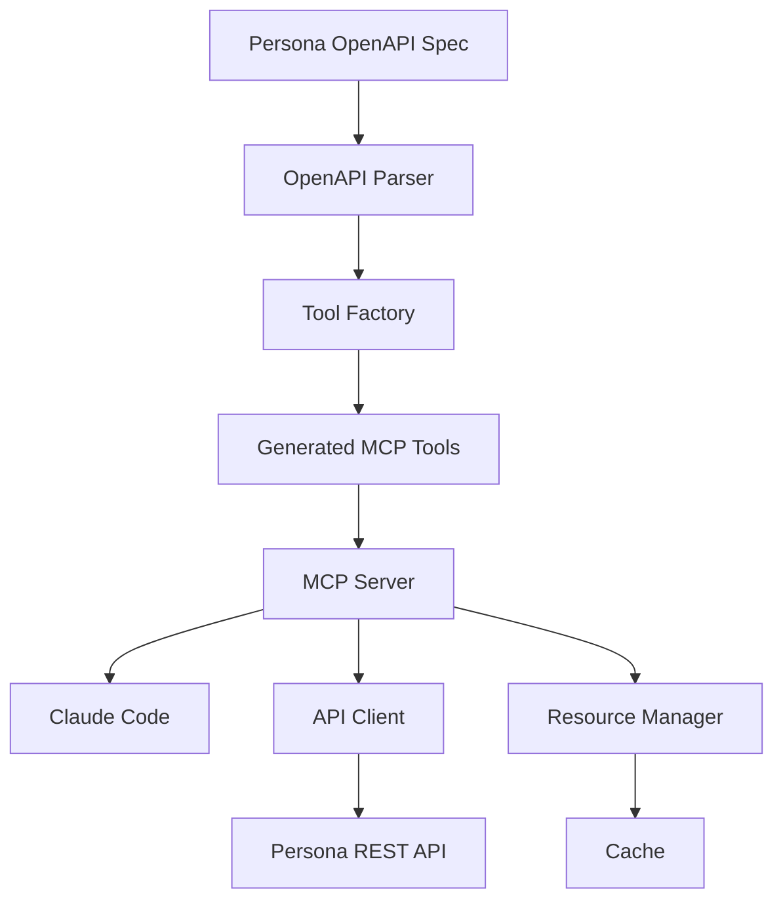

# Persona API MCP Server

A Model Context Protocol (MCP) server that integrates with Persona's REST API, optimized for usage with Claude Code. This server automatically generates MCP tools from Persona's OpenAPI specification, ensuring complete API coverage and type safety.

> **📁 Repository Structure**: This repository is designed to be cloned adjacent to the `persona-web` repository for local development. See [REPOSITORY_STRUCTURE.md](REPOSITORY_STRUCTURE.md) for details.

## 🚀 Features

- **🔄 Auto-Generated Tools**: MCP tools automatically generated from OpenAPI specs
- **📋 Complete API Coverage**: All Persona API endpoints exposed as MCP tools
- **💾 Smart Caching**: API responses cached and exposed as MCP resources
- **🔒 Type Safety**: Full TypeScript implementation with generated types
- **🎯 Claude Code Optimized**: Designed specifically for Claude Code integration
- **📊 Comprehensive Logging**: Structured logging with performance metrics
- **🔧 Development Friendly**: Hot reloading and extensive debugging support
- **📖 OpenAPI-Driven**: Stays in sync with Persona's API automatically

## 🏃‍♂️ Quick Start

### Prerequisites

- **Node.js 18+** - [Download here](https://nodejs.org/)
- **Persona API Key** - Get from your local Persona development environment
- **Claude Code** - [Download here](https://claude.ai/code) (for usage)
- **persona-web repository** - This repo should be cloned adjacent to persona-web

### Installation

1. **Clone the repository adjacent to persona-web:**
   ```bash
   # Assuming you have persona-web already cloned
   cd /path/to/your/projects  # Same directory as persona-web
   git clone <this-repo-url> persona-api-mcp

   # Your directory structure should look like:
   # /path/to/your/projects/
   # ├── persona-web/
   # └── persona-api-mcp/
   ```

2. **Setup the project:**
   ```bash
   cd persona-api-mcp
   npm install
   ```

3. **Create OpenAPI symlink:**
   ```bash
   # This creates a symlink to persona-web's OpenAPI specs
   ln -sf ../persona-web/openapi/external openapi

   # Verify the symlink works
   ls -la openapi/openapi.yaml
   ```

4. **Configure API access:**
   ```bash
   export PERSONA_API_KEY="your-local-api-key-here"
   ```

5. **Start your local Persona API server:**
   ```bash
   # In the persona-web directory
   cd ../persona-web
   # Start your local development server (usually on localhost:3000)
   # Follow persona-web's setup instructions
   ```

6. **Build and start the MCP server:**
   ```bash
   # Back in persona-api-mcp directory
   cd ../persona-api-mcp
   npm run build
   npm start
   ```

   You should see:
   ```
   ╔═══════════════════════════════════════════════════════════════╗
   ║                     Persona API MCP Server                   ║
   ║  🚀 Persona API MCP Server is running and ready for connections ║
   ╚═══════════════════════════════════════════════════════════════╝
   ```

### Development Mode

For development with hot reloading:
```bash
npm run dev
```

### 🛠️ Available Tools

All tools are **auto-generated** from Persona's OpenAPI specification:

#### 📋 Inquiry Management

| Tool | Description | Key Parameters |
|------|-------------|----------------|
| `inquiry_create` | Create a new inquiry | `inquiryTemplateId`, `referenceId`, `fields` |
| `inquiry_retrieve` | Get inquiry details by ID | `inquiryId`, `include` |
| `inquiry_list` | List inquiries with filtering | `statuses`, `pageSize`, `filters` |
| `inquiry_approve` | Approve an inquiry | `inquiryId` |
| `inquiry_decline` | Decline an inquiry | `inquiryId` |
| `inquiry_redact` | Redact inquiry PII | `inquiryId` |

> 💡 **Note**: Tool schemas are automatically updated when Persona's API changes!

### 💬 Usage Examples

#### Natural Language (Recommended)

```
Create a new inquiry using template itmpl_ABC123 for user with reference ID "user-123"
```

```
Show me all completed inquiries from the last week
```

```
Get full details for inquiry inq_ABC123 including all verifications and reports
```

#### Direct Tool Calls

**Create an Inquiry:**
```json
{
  "tool": "inquiry_create",
  "arguments": {
    "inquiryTemplateId": "itmpl_ABC123",
    "referenceId": "user-123",
    "autoCreateAccount": true,
    "fields": {
      "nameFirst": "John",
      "nameLast": "Doe"
    }
  }
}
```

**Retrieve an Inquiry:**
```json
{
  "tool": "inquiry_retrieve",
  "arguments": {
    "inquiryId": "inq_ABC123",
    "include": ["account", "verifications", "reports"]
  }
}
```

### 📦 Available Resources

Access cached API responses as resources:

| Resource URI | Description | Example |
|--------------|-------------|---------|
| `persona://inquiry/{id}` | Individual inquiry data | `persona://inquiry/inq_ABC123` |
| `persona://inquiries` | List of inquiries | `persona://inquiries?status=completed` |
| `persona://account/{id}` | Account data (future) | `persona://account/act_DEF456` |

**Example Usage:**
```
Read the resource persona://inquiry/inq_ABC123 and summarize the current status
```

### 🎯 Available Prompts

Pre-built prompts for common workflows:

| Prompt | Description | Parameters |
|--------|-------------|------------|
| `inquiry_analysis` | Analyze inquiry and provide insights | `inquiry_id` |
| `inquiry_review` | Review inquiry and suggest next steps | `inquiry_id`, `review_type` |
| `inquiry_troubleshooting` | Help troubleshoot inquiry issues | `inquiry_id`, `issue_description` |

**Example Usage:**
```
Use the inquiry_analysis prompt to analyze inquiry inq_ABC123
```

## 📚 Architecture

### OpenAPI-Driven Design



**Key Components:**

1. **OpenAPI Parser**: Parses Persona's YAML specifications
2. **Tool Factory**: Auto-generates MCP tools from parsed specs
3. **API Client**: Handles HTTP requests with retry logic
4. **Resource Manager**: Caches responses and exposes as resources
5. **MCP Server**: Orchestrates everything for Claude Code

### Benefits of This Approach

- **🔄 Always Up-to-Date**: Tools automatically reflect API changes
- **🔒 Type Safety**: Generated from authoritative source
- **📋 Complete Coverage**: Every endpoint becomes a tool
- **⚡ High Performance**: Intelligent caching and optimization
- **🛠️ Low Maintenance**: No manual schema updates required

## 🔧 Development

### Project Structure

```
src/
├── server/                    # MCP server implementation
│   ├── index.ts              # Main entry point
│   └── mcp-server.ts         # MCP server logic
├── api/                      # Persona API integration
│   ├── client.ts             # HTTP client with retry logic
│   └── types.ts              # TypeScript type definitions
├── tools/                    # MCP tool generation
│   ├── generators/           # OpenAPI-based generation
│   │   ├── openapi-parser.ts # Parse YAML specifications
│   │   └── tool-factory.ts   # Generate MCP tools
│   └── inquiry/              # Inquiry-specific tools
│       └── generated.ts      # Auto-generated tools
├── resources/                # Resource management
│   ├── manager.ts            # Resource exposure logic
│   └── cache.ts              # Intelligent caching
├── utils/                    # Shared utilities
│   ├── config.ts             # Configuration management
│   ├── logger.ts             # Structured logging
│   └── errors.ts             # Error handling
└── openapi/                  # Symlinked OpenAPI specs
```

### Available Scripts

```bash
npm run build        # Build for production
npm run dev          # Development with hot reload
npm run start        # Start production server
npm run test         # Run all tests
npm run lint         # Run ESLint
npm run lint:fix     # Fix linting issues
npm run type-check   # TypeScript type checking
```

### Debugging

Enable detailed logging:

```bash
LOG_LEVEL=debug npm run dev
```

### Adding New API Endpoints

1. **Update OpenAPI symlink** (if needed)
2. **Extend tool factory** to support new tags
3. **Tools auto-generate** from specifications
4. **No manual coding required!** 🎉

## 🚨 Troubleshooting

### Common Issues

#### ❌ API Key Problems

**Error:**
```
Configuration validation failed: persona.apiKey: String must contain at least 1 character(s)
```

**Solutions:**
- ✅ Set environment variable: `export PERSONA_API_KEY="your-key"`
- ✅ Check key format: Must start with `persona_live_` or `persona_test_`
- ✅ Restart terminal after setting variable

#### ❌ Connection Issues

**Error:**
```
Persona API connectivity check failed
```

**Solutions:**
- ✅ Verify local Persona API server is running on localhost:3000
- ✅ Test API key manually: `curl -H "Authorization: Bearer $PERSONA_API_KEY" http://localhost:3000/api/v1/inquiries?page[size]=1`
- ✅ Check persona-web development server status

#### ❌ Claude Code Integration

**Symptoms:**
- Server not appearing in Claude Code
- "Connection failed" status

**Solutions:**
- ✅ Use **absolute paths** in configuration
- ✅ Verify file permissions: `chmod +x dist/server/index.js`
- ✅ Test server manually first: `npm start`
- ✅ Check Claude Code logs for errors

### 🔍 Health Checks

The server performs automatic health checks:

```bash
npm start
# Look for: ✅ Persona API connectivity check passed
```

### 💾 Cache Management

**Clear cache:**
- Restart server: `npm start`
- Disable caching: `CACHE_ENABLED=false npm start`

**Monitor cache:**
```bash
LOG_LEVEL=debug npm run dev
# Watch for cache hit/miss logs
```

## 🤝 Contributing

We welcome contributions! Here's how to get started:

1. **Fork the repository**
2. **Create a feature branch**: `git checkout -b feature/amazing-feature`
3. **Make your changes** (following our code style)
4. **Add tests** for new functionality
5. **Submit a pull request**

### Code Style Guidelines

- **TypeScript**: Strict mode enabled
- **ESLint**: Code quality enforcement
- **Prettier**: Consistent formatting
- **Documentation**: JSDoc for public APIs
- **Testing**: Jest for unit tests
- **Commits**: Conventional commit format

## 📄 License

MIT License - see [LICENSE](LICENSE) file for details.

## 🆘 Support

Need help? Here's how to get support:

1. **📚 Check Documentation**: Review this README and [SETUP.md](SETUP.md)
2. **🔍 Enable Debug Logging**: `LOG_LEVEL=debug npm run dev`
3. **🐛 Open an Issue**: [GitHub Issues](https://github.com/your-org/persona-api-mcp/issues)

When reporting issues, please include:
- Full error messages
- Configuration (sanitized)
- Steps to reproduce
- Expected vs actual behavior

## 🗺️ Roadmap

### ✅ Completed (v1.0)
- ✅ OpenAPI-driven tool generation
- ✅ Complete Inquiry API coverage
- ✅ Resource management and caching
- ✅ Claude Code integration
- ✅ Production-ready infrastructure

### 🔄 In Progress (v1.1)
- 🔄 Account management endpoints
- 🔄 Verification endpoints
- 🔄 Report endpoints

### 📋 Planned (v2.0)
- 📋 Webhook support
- 📋 Advanced caching strategies
- 📋 Custom prompt templates
- 📋 Performance optimizations
- 📋 Plugin architecture
- 📋 Real-time updates

---

<div align="center">

**Built with ❤️ for the Claude Code community**

[Documentation](SETUP.md) • [Issues](https://github.com/your-org/persona-api-mcp/issues) • [Contributing](CONTRIBUTING.md)

</div>
