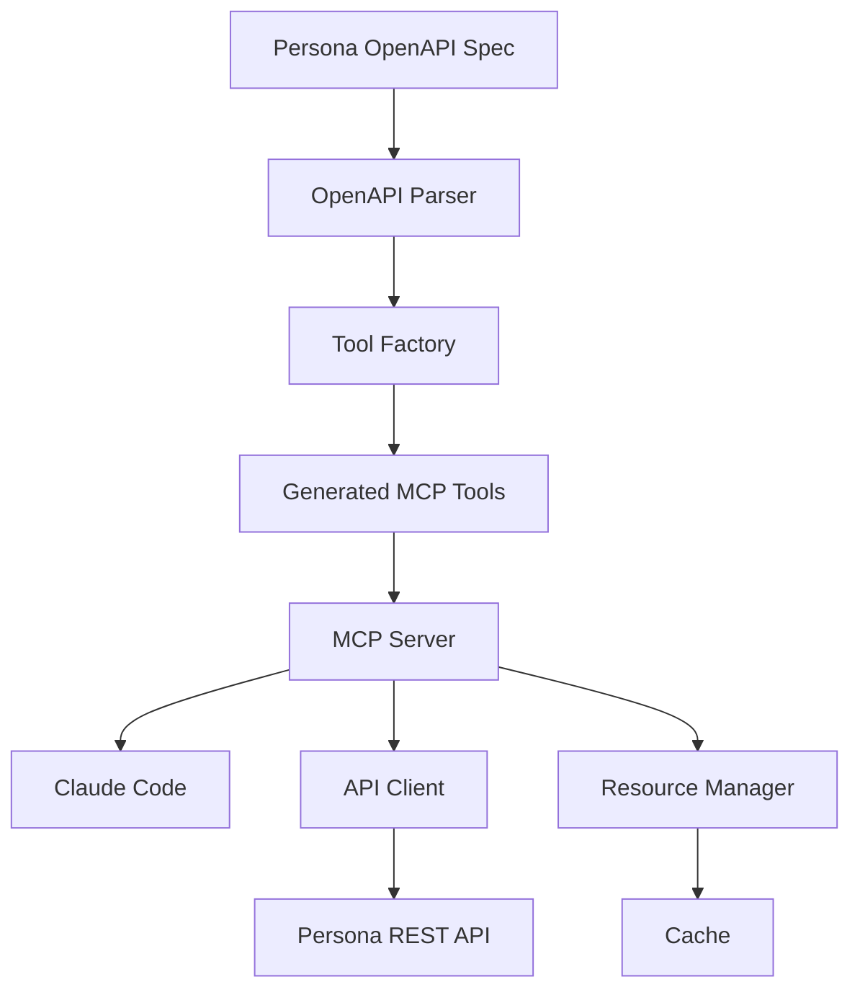

# Persona API MCP Server

## IMPORTANT

This is an entirely vibe coded project I did to understand MCPs better. While it's actually somewhat useful for testing things locally, and while it technically works for staging / production, I definitely don't recommend using it outside of local dev for now.

Right now it is capable of:

- Index and show operations (exposed as resources)
- Create, update, delete operations (exposed as tools)
- Modifying resources (update, redact, etc.)
- Summarizing information about resources (haven't found this to be that useful yet; likely more prompt optimization needed)
- Introspecting the OpenAPI docs to understand how to call endpoints via the openapi resource

## Overview

A Model Context Protocol (MCP) server that integrates with Persona's REST API, optimized for usage with Claude Code. This server automatically generates MCP tools from Persona's OpenAPI specification, ensuring complete API coverage and type safety.

### Sample prompts

```
"Fetch the latest account using the persona-api MCP. Then, make a new account with the same environment id but with reference id = 'cloned account'."
readMcpResource(Read resource "persona://accounts" from server "persona-api")
persona-api:account_create (MCP)(referenceId: "cloned account")

"Fetch the latest inquiry using the persona-api MCP. Then, make a new inquiry with the same template and environment but with all string fields set to 'TEST'."
readMcpResource(Read resource "persona://inquiries" from server "persona-api")
persona-api:inquiry_create (MCP)(inquiryTemplateId: "itmpl_7XSTzJL67KWgFSi2ZFvkKQnpgd4u", fields: "{\n  \"name-first\": \"TEST\",\n  \"name-middle\": \"TEST\", \n  \"name-last\":
                                  \"TEST\",\n  \"address-street-1\": \"TEST\",\n  \"address-street-2\": \"TEST\",\n  \"address-city\": \"TEST\",\n  \"address-subdivision\":
                                  \"TEST\",\n  \"address-postal-code\": \"TEST\",\n  \"address-country-code\": \"TEST\",\n  \"email-address\": \"TEST\",\n  \"phone-number\":
                                  \"TEST\",\n  \"identification-number\": \"TEST\",\n  \"identification-class\": \"TEST\",\n  \"selected-country-code\": \"TEST\",\n
                                  \"selected-id-class\": \"TEST\",\n  \"card-access-number\": \"TEST\",\n  \"issuing-authority\": \"TEST\"\n}")

"Redact the latest inquiry."
persona-api:inquiry_redact (MCP)(inquiryId: "inq_JALcUqsXm8f9SgtZAvL5UApwtDCi")

"Fetch all inquiries for the inquiry template itmpl_R8251hnpDBWCV2ckTnVqgtYm24Ac."
readMcpResource(Read resource "persona://inquiries?filter[inquiry-template-id]=itmpl_R8251hnpDBWCV2ckTnVqgtYm24Ac" from server "persona-api")

"Show me all resources that the persona-api MCP exposes."
listMcpResources(List MCP resources from server "persona-api")
```

> **📁 Repository Structure**: This repository is designed to be cloned adjacent to the `persona-web` repository for local development. See [REPOSITORY_STRUCTURE.md](REPOSITORY_STRUCTURE.md) for details.

## 🚀 Features

- **🔄 Auto-Generated Tools**: MCP tools automatically generated from OpenAPI specs
- **📋 Complete API Coverage**: All Persona API endpoints exposed as MCP tools
- **💾 Smart Caching**: API responses cached and exposed as MCP resources
- **🔒 Type Safety**: Full TypeScript implementation with generated types
- **🎯 Claude Code Optimized**: Designed specifically for Claude Code integration
- **📊 Comprehensive Logging**: Structured logging with performance metrics
- **🔧 Development Friendly**: Hot reloading and extensive debugging support
- **📖 OpenAPI-Driven**: Stays in sync with Persona's API automatically

## 🏃‍♂️ Quick Start

### Prerequisites

- **Node.js 18+** - [Download here](https://nodejs.org/)
- **Persona API Key** - Get from your local Persona development environment
- **Claude Code** - [Download here](https://claude.ai/code) (for usage)
- **persona-web repository** - This repo should be cloned adjacent to persona-web

### Installation

1. **Clone the repository adjacent to persona-web:**
   ```bash
   # Assuming you have persona-web already cloned
   cd /path/to/your/projects  # Same directory as persona-web
   git clone <this-repo-url> persona-api-mcp

   # Your directory structure should look like:
   # /path/to/your/projects/
   # ├── persona-web/
   # └── persona-api-mcp/
   ```

2. **Setup the project:**
   ```bash
   cd persona-api-mcp
   npm install
   export PERSONA_API_KEY="your-local-api-key-here"
   # or create a .env file with PERSONA_API_KEY="your-local-api-key-here"
   npm run build
   ```

3. **Enable the MCP in `~/.claude.json`:**
   ```json
   {
     "mcpServers": {
       "persona-api": {
         "type": "stdio",
         "command": "node",
         "cwd": "/absolute/path/to/persona-api-mcp",
         "args": [
           "/absolute/path/to/persona-api-mcp/dist/server/index.js"
         ]
       },
     }
   }
   ```

4. **Run Claude Code from `persona-web/`:**
   ```bash
   # Back in persona-api-mcp directory
   cd ../persona-web
   claude
   ```

   When running `/mcp` you should see the `persona-api` MCP.


### 🛠️ Available Tools

All tools are **auto-generated** from Persona's OpenAPI specification:

#### 📋 Inquiry Management

| Tool | Description | Key Parameters |
|------|-------------|----------------|
| `inquiry_create` | Create a new inquiry | `inquiryTemplateId`, `referenceId`, `fields` |
| `inquiry_retrieve` | Get inquiry details by ID | `inquiryId`, `include` |
| `inquiry_list` | List inquiries with filtering | `statuses`, `pageSize`, `filters` |
| `inquiry_approve` | Approve an inquiry | `inquiryId` |
| `inquiry_decline` | Decline an inquiry | `inquiryId` |
| `inquiry_redact` | Redact inquiry PII | `inquiryId` |

> 💡 **Note**: Tool schemas are automatically updated when Persona's API changes!

### 💬 Usage Examples

#### Natural Language (Recommended)

```
Create a new inquiry using template itmpl_ABC123 for user with reference ID "user-123"
```

```
Show me all completed inquiries from the last week
```

```
Get full details for inquiry inq_ABC123 including all verifications and reports
```

#### Direct Tool Calls

**Create an Inquiry:**
```json
{
  "tool": "inquiry_create",
  "arguments": {
    "inquiryTemplateId": "itmpl_ABC123",
    "referenceId": "user-123",
    "autoCreateAccount": true,
    "fields": {
      "nameFirst": "John",
      "nameLast": "Doe"
    }
  }
}
```

**Retrieve an Inquiry:**
```json
{
  "tool": "inquiry_retrieve",
  "arguments": {
    "inquiryId": "inq_ABC123",
    "include": ["account", "verifications", "reports"]
  }
}
```

### 📦 Available Resources

Access cached API responses as resources:

| Resource URI | Description | Example |
|--------------|-------------|---------|
| `persona://inquiry/{id}` | Individual inquiry data | `persona://inquiry/inq_ABC123` |
| `persona://inquiries` | List of inquiries | `persona://inquiries?status=completed` |
| `persona://account/{id}` | Account data (future) | `persona://account/act_DEF456` |

**Example Usage:**
```
Read the resource persona://inquiry/inq_ABC123 and summarize the current status
```

### 🎯 Available Prompts

Pre-built prompts for common workflows:

| Prompt | Description | Parameters |
|--------|-------------|------------|
| `inquiry_analysis` | Analyze inquiry and provide insights | `inquiry_id` |
| `inquiry_review` | Review inquiry and suggest next steps | `inquiry_id`, `review_type` |
| `inquiry_troubleshooting` | Help troubleshoot inquiry issues | `inquiry_id`, `issue_description` |

**Example Usage:**
```
Use the inquiry_analysis prompt to analyze inquiry inq_ABC123
```

## 📚 Architecture

### OpenAPI-Driven Design



**Key Components:**

1. **OpenAPI Parser**: Parses Persona's YAML specifications
2. **Tool Factory**: Auto-generates MCP tools from parsed specs
3. **API Client**: Handles HTTP requests with retry logic
4. **Resource Manager**: Caches responses and exposes as resources
5. **MCP Server**: Orchestrates everything for Claude Code


## 🔧 Development

### Project Structure

```
src/
├── server/                    # MCP server implementation
│   ├── index.ts              # Main entry point
│   └── mcp-server.ts         # MCP server logic
├── api/                      # Persona API integration
│   ├── client.ts             # HTTP client with retry logic
│   └── types.ts              # TypeScript type definitions
├── tools/                    # MCP tool generation
│   ├── generators/           # OpenAPI-based generation
│   │   ├── openapi-parser.ts # Parse YAML specifications
│   │   └── tool-factory.ts   # Generate MCP tools
│   └── inquiry/              # Inquiry-specific tools
│       └── generated.ts      # Auto-generated tools
├── resources/                # Resource management
│   ├── manager.ts            # Resource exposure logic
│   └── cache.ts              # Intelligent caching
├── utils/                    # Shared utilities
│   ├── config.ts             # Configuration management
│   ├── logger.ts             # Structured logging
│   └── errors.ts             # Error handling
└── openapi/                  # Symlinked OpenAPI specs
```


### Adding New API Endpoints

1. **Update OpenAPI symlink** (if needed)
2. **Extend tool factory** to support new tags
3. **Tools auto-generate** from specifications
    * This doesn't work as is, just ask Claude to vibe-code up the new tools
4. **No manual coding required!** 🎉

## 🚨 Need Help?

- **Quick Issues**: See our [Troubleshooting Guide](docs/TROUBLESHOOTING.md)
- **Tool Usage**: Check the [Tool Usage Guide](docs/TOOL_USAGE_GUIDE.md)
- **Development**: Read the [Development Guidelines](AGENTS.md)

## 🤝 Contributing

We welcome contributions! Here's how to get started:

1. **Fork the repository**
2. **Create a feature branch**: `git checkout -b feature/amazing-feature`
3. **Make your changes** (following our code style)
4. **Add tests** for new functionality
5. **Submit a pull request**

### Code Style Guidelines

- **TypeScript**: Strict mode enabled with comprehensive type safety
- **ESLint**: Code quality enforcement
- **Prettier**: Consistent formatting
- **Documentation**: JSDoc for public APIs
- **Testing**: Vitest for unit tests with security-focused test patterns
- **Security**: Input validation and error handling patterns from Anthropic's MCP server
- **Commits**: Conventional commit format

## 📄 License

MIT License - see [LICENSE](LICENSE) file for details.

